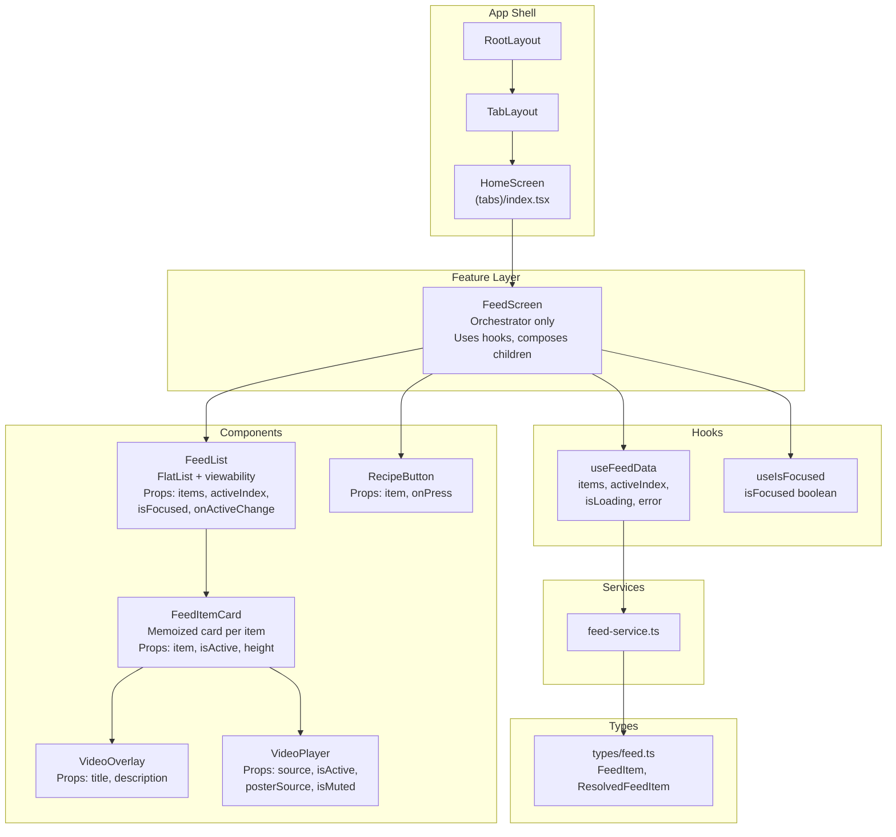

# Feed Component Architecture

```mermaid
graph TD
    subgraph "App Shell"
        RootLayout["RootLayout"]
        TabLayout["TabLayout"]
        HomeScreen["HomeScreen<br/>(tabs)/index.tsx"]
    end

    subgraph "Feature Layer"
        FeedScreen["FeedScreen<br/>Orchestrator only<br/>Uses hooks, composes children"]
    end

    subgraph "Hooks"
        useFeedData["useFeedData<br/>items, activeIndex,<br/>isLoading, error"]
        useTabFocus["useIsFocused<br/>isFocused boolean"]
    end

    subgraph "Components"
        FeedList["FeedList<br/>FlatList + viewability<br/>Props: items, activeIndex,<br/>isFocused, onActiveChange"]
        FeedItemCard["FeedItemCard<br/>Memoized card per item<br/>Props: item, isActive, height"]
        VideoOverlay["VideoOverlay<br/>Props: title, description"]
        VideoPlayer["VideoPlayer<br/>Props: source, isActive,<br/>posterSource, isMuted"]
        RecipeButton["RecipeButton<br/>Props: item, onPress"]
    end

    subgraph "Services"
        FeedService["feed-service.ts"]
    end

    subgraph "Types"
        FeedTypes["types/feed.ts<br/>FeedItem, ResolvedFeedItem"]
    end

    RootLayout --> TabLayout --> HomeScreen --> FeedScreen
    FeedScreen --> useFeedData
    FeedScreen --> useTabFocus
    FeedScreen --> FeedList
    FeedScreen --> RecipeButton

    useFeedData --> FeedService
    FeedService --> FeedTypes

    FeedList --> FeedItemCard
    FeedItemCard --> VideoPlayer
    FeedItemCard --> VideoOverlay
```
